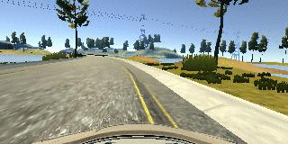
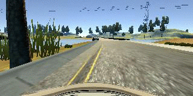
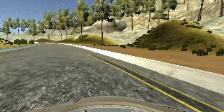
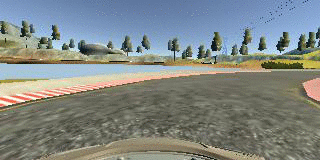
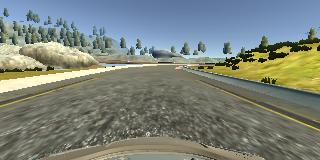
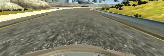

# Udacity Self Driving Car Nanondegree 

## Project 3: **Behavioral Cloning** 

The goals / steps of this project are the following:

* Use the simulator to collect data of good driving behavior
* Build, a convolution neural network in Keras that predicts steering angles from images
* Train and validate the model with a training and validation set
* Test that the model successfully drives around track one without leaving the road
* Summarize the results with a written report

This `README.md` is organized to follow the project requirement rubrics.

## Usage

Using the Udacity provided simulator and my drive.py file, the car can be driven autonomously around the track by executing 

```sh
curl -O http://brianz-udacity-sdc.s3.amazonaws.com/p3/model.h5
python drive.py model.h5
```

## Required Files

This project consists of the following files:

- This `README.md` file which you're reading
- `model.py` is the single Python file which implements the entire CNN model. Output after running
  this file is a single model file with the current timestamp embedded in the name.
- `drive.py` which is used to connect the simulator to the trained model and steer the car based
- `model.h5` model file which, due to it's size, is stored on S3: http://brianz-udacity-sdc.s3.amazonaws.com/p3/model.h5


## Quality of Code

The `model.py` file is fully self contained and can be run as-is provided the dependencies are installed on a local system.

Generators are used to provide training and validation data.  These can be found on lines 
[77](model.py#L77), 
[110](model.py#L110)
and [115](model.py#L115)


## Model Architecture and Training Strategy

### Model
`model.py` includes an implemenation of the [Nvida model which can be found at this blog post](https://devblogs.nvidia.com/parallelforall/deep-learning-self-driving-cars/).
This model can be seen in the [`get_model` function](model.py#L120)
and consists of:

- normalization
- 3 `5x5` convolutions with 3, 24 and 36 output layers, each with a `2x2` stride and a Relu activation
- 2 `3x3` convolutions with 48 and 48 output layers, each with a `1x1` stride and Relu activation
- 1 flattening layer
- 4 fully connected layers with 1164, 100, 50 and 10 output layers, each with Relu activation
- 1 finaly fully connected layer with a single output which consists of the final steering angle prediction

### Training data

For this project I used the Udacity-provided data set along with my own manually collected data sets.

The driving data I collected can be broken into two sections:

- "Normal" driving around the track
  - Favor left side of track
  - Favor center of track
  - Favor right side of track
- "Hard turns" and critical turns along the track

#### Normal driving

The normal driving which I performed was simply driving the track either in the center of the road or on the right 
side of the road. I originally had another data set where I drove on the left side of the road, however I found with
that data set performance was much worse where the car would drive too far to the left and off the road. By removing
the left side driving the results were much better

#### Hard turns and critical turns

Initially, I started driving in automomous mode with just the "normal driving" data. I quickly found that the car had
no idea how to handle driving near or off the side of the road and would never recover. To deal with this, I 
created datasets where I would perform the following at different parts of the track:

- while starting off driving on the right or left lane, start recording and turn hard to get to the center of the road
- while headed off/pointing towards the side of the road, start recording and turn hard to re-center
- at critical parts of the track, namely big turns, make successive recordsing ensuring to make hard rather
  than gradual turns

**Hard turns after driving on lane**





**Hard turn to center after heading off road**





### Training strategy

I initially tried testing after trianing on the "Normal" driving data.  After poor performance on the first turn
(where the car simply drove off into the water) I created 3-4 recordings on turn one where I would 

- get the car set up in the turn, pointing directly toward the edge of the road toward the water
- while the car was moving, hit spacebar to start recording
- turn hard left into the middle of the road
- end recording
- back car up and repeat

At some point I tried cropping the top 60 pixels of the images in order to focus just on the road features.
This appeared to work well while also reducing the number of features the model needed to calculate, speeding
up training. Below is an example of the original image and the cropped image:




I followed an iterative process of

### Attempts to reduce overfitting in the model

I found that I started to get quite good result fairly quickly as soon as I introduced hard turn and key turn data sets. 
After visualizing a historgram of the test data it was clear that the vast majority of test data was associated with 
`0.0°` steering angle. I performed some basic culling of the data before the model even started running.

My heuristic for trimming data was quite simple: take variable amount of `0.0°` steering data from the Udacity data set
and take 100% of my own data set. This can be seen in [the `take_record` function](model.py#L29-L43) 
and it's usage in the [`build_img_list` function](model.py#L67).

Additionally, I experiemented with turning different data sets on and off.  I found that my model performed very well
when I turned off my "normal" data set where I drived mostly on the left side of the track.

I _did_ try adding some dropout layers at different steps. However, the model actually performed _worse_ when testing
with the simulator.

### Model parameter tuning

[The model used an adam optimizer](model.py#L195), so the 
learning rate was not tuned manually.


## Architecture and Training Documentation

I started with the [Nvidia model](https://devblogs.nvidia.com/parallelforall/deep-learning-self-driving-cars/) mostly
as an experiement and figuring that this model had already produced solid results. Since I continued to see
good results and saw big changes with changes in training data I focused on producing quality training data
over experimenting with different models.

## Performance
<iframe width="560" height="315" src="https://www.youtube.com/embed/VeFm4lJxAGk?ecver=1" frameborder="0" allowfullscreen></iframe>

<a href="http://www.youtube.com/watch?feature=player_embedded&v=VeFm4lJxAGk" target="_blank">
  
</a>
